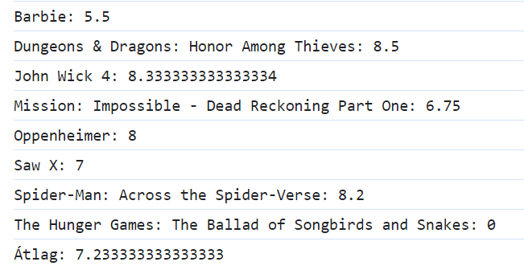
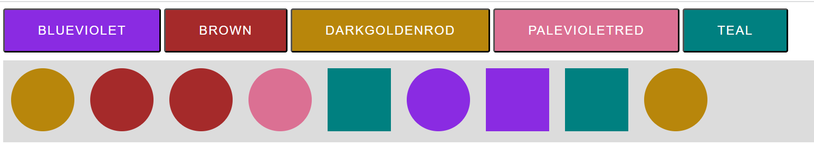

# Webprogramozás 2024-2025-1 JavaScript Házi Feladat 1

A megoldásokat küldjétek a babuafi@inf.elte.hu e-mail címre.

## 1. feladat (hf1_1) (1 pont)

Adott egy tömb idei filmek adataival.

Az egyes filmekről a következő információkat tároljuk:
- title: A film címe.
- studio: A filmet gyártó stúdió neve.
- month: A megjelenés hónapja angolul.
- reviews: Az értékelések (pontszámok) amelyeket a film felhasználóktól kapott.
           Az értékelések egy 10-értékes "csillagos" rendszerben történtek (1-10).

Az alábbi alfeladatok eredményét írasd ki a console-ra.

1.1 **Keresd meg a márciusban (March) megjelent filmeket.** (1 pont)

1.2 **Írasd ki a filmek címét (és csak a címét!) ABC rendben.** (1 pont)
Olyan összehasonlítási módot használj, amely működne ékezetes karakterek esetén is!

1.3 **Készíts egy egyedi listát a filmeket gyártó stúdiók nevéről.
      Tehát az eredményként kiadott tömbben a stúdiók nevei szerepeljenek, azonban mindegyik csak egyszer.** (1 pont)

1.4 **Döntsd el, hogy szerepel-e olyan film a listában ami Szeptemberben (September) jelent meg.** (1 pont)

1.5 **Írasd ki, hogy összesen (nem filmenként!) hány darab értékelés készült.** (1 pont)

+1 **Listázd ki a filmek átlagos értékelését, majd pedig az összes film átlagos pontszámát.** (1 pont)
Tartsd fejben, hogy nem minden filmre érkeztek értékelések!
A helyes eredmény így nézne ki:

## 2. feladat (hf1_2) (1 pont)

Az oldalon találsz 5 gombot 5 színnel és egy "container" azonosítójú elemet.

2.1 **A "container" azonosítójú elemre kattintva felugró üzenetben írd ki a következőt: "You can find the clicked colors here (if you look closely)!".** (1 pont)

2.2 **Egy színhez tartozó gomb klikkelésekor szúrj be egy kört a "container" azonosítójú elembe.** (2 pont)

Ahhoz, hogy kört kapj, használd a "hf1_2.css" fájlban implementált "circle" osztályt.
A kör háttere legyen a gombnak megfelelő.

2.3 **Ha a felhasználó beszúrt körre kattint, az váltakozzon négyzet és kör között.** (1 pont)

Ehhez csak annyit kell tenned, hogy a körön szereplő "circle" osztályt "rectangle"-re cseréled, "rectangle" esetén pedig azt "circle"-re.

2.4 **Amennyiben a felhasználó egy körre vagy négyzetre kattint - és nem a konténer hátterére - akkor NE ugorjon fel a 2.1-es feladatban megvalósított üzenet!** (1 pont)

+1 **A beszúrt színek automatikusan kerüljenek mentésre localStorage-be.** (1 pont)

Az alakzatot (hogy éppen kör vagy négyzet-e) nem szükséges menteni.

Az oldal megnyitásakor töltsük is vissza a mentett állapotot.
